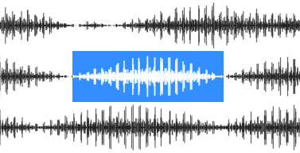

# wavefont

A typeface for rendering data: waveforms, spectrums, diagrams, bars etc.

<a href="https://dy.github.io/wavefont"></a>

[**Demo**](https://dy.github.io/wavefont)&nbsp;&nbsp;•&nbsp;&nbsp;[**v-fonts/wavefont**](https://v-fonts.com/fonts/wavefont)


## Usage

Place [_wavefont.woff2_](./wavefont.woff2) into your project directory and use this code:

```html
<style>
@font-face {
	font-family: wavefont;
	font-display: block;
	src: url(./wavefont.woff2) format('woff2');
}
.wavefont {
	--wght: 10;
	font-family: wavefont;
	font-variation-settings: 'wght' var(--wght), 'ROND' 30;
}
</style>

<!-- Set values manually -->
<textarea id="waveform" class="wavefont" cols="100">
abcdefghijklmnopqrstuvwwxyzABCDEFGHIJKLMNOPQRSTUVWXYZ
</textarea>

<script>
// Set values programmatically (more precise)
waveform.textContent = Array.from({length: 100}, (_,i) => String.fromCharCode(0x100 + i)).join('')
</script>
```

## Ranges

Wavefont bars correspond to values from 0 to 100, assigned to different characters:

* <kbd>0-9</kbd> chars are for simplified manual input with step 10.
* <kbd>a-zA-Z</kbd> for extended manual input with step 2, softened at edges <kbd>a</kbd> and <kbd>Z</kbd>.
* <kbd>U+0100-016F</kbd> for 0..100 bottom aligned values (convert as `char = String.fromCharCode(0x100 + value)`).
* <kbd>U+0400-046F</kbd> for 0..100 center aligned values (convert as `char = String.fromCharCode(0x400 + value)`).

## Variable axes

Tag | Range | Meaning
---|---|---
`wght` | _1_-_400_ | Bar width, or boldness (in upm).
`ROND` | _0_-_100_ | Border radius, or roundness (percent).

`letter-spacing` CSS property with `ch` units is useful to adjust distance between bars, 1ch === 1 bar width.

## Features

* Anti-[FOUT](https://css-tricks.com/fout-foit-foft/): any character out of visible range is mapped to blank (similar to [Adobe Blank](https://github.com/adobe-fonts/adobe-blank-vf)).
* Visible charcodes fall under _marking characters_ unicode category, ie. recognized as word by regexp and can be selected with <kbd>Ctrl</kbd> + <kbd>→</kbd> or double click. Eg. waveform chunks are selectable, if separated by space.
* Shifting up can be done via combining accent acute <kbd>&nbsp;&#x0301;</kbd> (U+0301) for 1-step up, or circumflex accent <kbd>&nbsp;&#x0302;</kbd> (U+0302) for 10-steps up. Eg. `\u0101\u0302\u0302\u0301\u0301\u0301` shifts 1 value 23 steps up.
* Shifting down can be done via combining accent grave <kbd>&nbsp;&#x0300;</kbd> (U+0300) for 1-step down, eg. `\u0101\u0300\u0300\u0300` shifts bar 3 values down.
* Space, tab and other non-marking chas map to _0_ value.
* `-–._*` map to _1_ value, `|` maps to max value, `▁▂▃▄▅▆▇█` map to corresponding bars.
* Values above chars range are supported to some extent, eg. _0x164_ (dec 101) is supported and value above 108 is discarded.

## JS package

To facilitate calculation, wavefont exposes a JS package with bar calculators for bottom-aligned or center-aligned faces.

```js
import * as wavefont from 'wavefont'

// get bottom aligned characters for values from 0..100 range
wavefont.lower(0, 1, 50, 99, 100, 101, ...)

// get center aligned characters for values from 0..100 range
wavefont.center(0, 1, 50, 99, 100, 101, ...)
```

## Building

Wavefont can be built in 2 ways: via google fonts tools or afdko.

1. For google fonts generation run `make build`.

2. For afdko generation run `npm run build`.

## See also

* [linefont](https://github.com/dy/linefont) − font-face for rendering linear data.

## References

* [Google Fonts guide](https://googlefonts.github.io/gf-guide/variable.html#most-common-axes).
* [Unified font object spec](https://unifiedfontobject.org/versions/ufo3) − unified human-readable format for storing font data.
* [Feature file spec](https://adobe-type-tools.github.io/afdko/OpenTypeFeatureFileSpecification.html#6.h) − defining opentype font features.
* [Unicode-table](https://unicode-table.com/) − convenient unicode table.
* [Adobe-variable-font-prototype](https://github.com/adobe-fonts/adobe-variable-font-prototype) − example variable font.
* [Designspace XML spec](https://github.com/fonttools/fonttools/tree/main/Doc/source/designspaceLib#document-xml-structure) − human-readable format for describing variable fonts.
* [Adobe Blank](https://github.com/adobe-fonts/adobe-blank-vf) − blank characters variable font.

<p align="center"><a href="https://github.com/krsnzd/license/">🕉</a><p>
