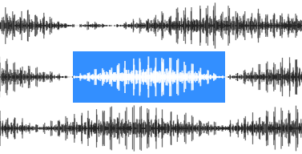

# wavefont [](https://github.com/dy/wavefont/actions/workflows/build.yaml)

A typeface for rendering vertical bars data: waveforms, spectrums, diagrams, histograms, columns etc.



[**Playground**](https://dy.github.io/wavefont/scripts)&nbsp;&nbsp;•&nbsp;&nbsp;[**Google fonts**](https://fonts.google.com/specimen/Wavefont)&nbsp;&nbsp;•&nbsp;&nbsp;[**V-fonts**](https://v-fonts.com/fonts/wavefont)&nbsp;&nbsp;•&nbsp;&nbsp;
[**Wavearea**](https://dy.github.io/wavearea?src=https://cdn.freesound.org/previews/147/147582_1728127-lq.mp3)

## Usage

Place [_Wavefont[ROND,YELA,wght].woff2_](./fonts/variable/Wavefont[ROND,YELA,wght].woff2) into your project directory and use this code:

```html
<style>
@font-face {
	font-family: wavefont;
	font-display: block;
	src: url(./Wavefont[ROND,YELA,wght].woff2) format('woff2');
}
.wavefont {
	--wght: 400;
	font-family: wavefont;
	font-variation-settings: 'wght' var(--wght), 'ROND' 30, 'YELA' 0;
}
</style>

<!-- Set values manually -->
<textarea id="waveform" class="wavefont" cols="100">
abcdefghijklmnopqrstuvwwxyzABCDEFGHIJKLMNOPQRSTUVWXYZ
</textarea>

<script>
// Set values programmatically (more precise)
waveform.textContent = Array.from({length: 100}, (_,i) => String.fromCharCode(0x100 + i)).join('')
</script>
```

## Ranges

Wavefont bars correspond to values from 0 to 100, assigned to different characters:

* <kbd>0-9</kbd> chars are for simplified manual input with step 10 (bar height = number).
* <kbd>a-zA-Z</kbd> for manual input with step 2, softened at edges <kbd>a</kbd> and <kbd>Z</kbd> (bar height = number of letter).
* <kbd>U+0100-017F</kbd> for 0..127 values with step 1 (`char = String.fromCharCode(0x100 + value)`). <kbd>U+0180</kbd> renders as max bar (off-by-one clamp guard), higher codepoints render blank — clamp values to _127_.

## Variable axes

Tag | Range | Default | Meaning
---|---|---|---
`wght` | _4_-_1000_ | 100 | Bar width, or boldness. Advance width scales with it: _100_ ≙ 0.025em, _400_ ≙ 0.1em, _1000_ ≙ 0.25em.
`ROND` | _0_-_100_ | 100 | Border radius, or roundness (percent).
`YELA` | _-100_-_100_ | -100 | Alignment: bottom (_-100_), center (_0_) or top (_100_).

To adjust axes via CSS:
```css
.wavefont {
  font-variation-settings: 'wght' var(--wght, 40), 'ROND' var(--rond, 0), 'YELA' var(--align, 0);
  letter-spacing: 1ch; /* 1ch unit === 1 bar width */
}
```

## Features

* Ranges, values and width is compatible with [linefont](https://github.com/dy/linefont), so fonts can be switched preserving visual coherency.
* Visible charcodes fall under _marking characters_ unicode category, ie. recognized as word by regexp and can be selected with <kbd>Ctrl</kbd> + <kbd>→</kbd> or double click. Eg. waveform segments separated by ` ` or `-` are selectable by double click.
* Characters outside of visible ranges are clipped to _0_, eg. ` `, `\t` etc.
* `-–._*` map to _1_ value, `|` maps to max value, `▁▂▃▄▅▆▇█` map to corresponding bars.
* Accent acute <kbd>&nbsp;&#x0301;</kbd> (U+0301) shifts bar 1-step up, circumflex accent <kbd>&nbsp;&#x0302;</kbd> (U+0302) 10-steps up. Eg. `\u0101\u0302\u0302\u0301\u0301\u0301` shifts 23 steps up.
* Accent grave <kbd>&nbsp;&#x0300;</kbd> (U+0300) shifts bar 1-step down, caron <kbd>&nbsp;&#x030c;</kbd> (U+030C) shifts 10 steps down, eg. `\u0101\u030c\u0300\u0300\u0300` shifts 13 steps down.
* Mark order is canonical: 10-step marks first, then up to nine 1-step marks, \u00b1100 steps max. Runs of 11+ same 1-step marks are recognized only up to the 10th \u2014 use `shift()` from the JS package to encode correctly.
* Caret span is -30..130 (covers full ink incl. value 127 bars), so line-height = 1.6 is minimal non-overlapping selection.
<!-- * Anti-[FOUT](https://css-tricks.com/fout-foit-foft/): any character out of visible range is mapped to blank (similar to [Adobe Blank](https://github.com/adobe-fonts/adobe-blank-vf)). -->

## JS package

Optional wavefont package exposes a function that calculates string from values for your convenience. Types included.

```js
import wf, { char, shift } from 'wavefont'

// characters for values from 0..127 range (clamped & rounded)
wf(0, 1, 50, 99, 127) // 'ĀāIJţſ'

// arrays or typed arrays of any length
wf(new Float32Array([0, 64, 127])) // 'Āŀſ'

// single value char + canonical shift marks (10-step first, then 1-step)
char(64) + shift(23)  // bar 64 shifted 23 steps up
char(64) + shift(-13) // bar 64 shifted 13 steps down
```


## Building

`make build`

* [Tests](https://dy.github.io/wavefont/out/fontbakery/fontbakery-report)
* [Glyphs](https://dy.github.io/wavefont/out/proof/glyphs)
* [Text](https://dy.github.io/wavefont/out/proof/text)
* [Waterfall](https://dy.github.io/wavefont/out/proof/waterfall)

## See also

* [linefont](https://github.com/dy/linefont) − font-face for rendering linear data.

## References

* [Google Fonts guide](https://googlefonts.github.io/gf-guide/variable.html#most-common-axes).
* [Unified font object spec](https://unifiedfontobject.org/versions/ufo3) − unified human-readable format for storing font data.
* [Feature file spec](https://adobe-type-tools.github.io/afdko/OpenTypeFeatureFileSpecification.html#6.h) − defining opentype font features.
* [Adobe-variable-font-prototype](https://github.com/adobe-fonts/adobe-variable-font-prototype) − example variable font.
* [Designspace XML spec](https://github.com/fonttools/fonttools/tree/main/Doc/source/designspaceLib#document-xml-structure) − human-readable format for describing variable fonts.
* [Adobe Blank](https://github.com/adobe-fonts/adobe-blank-vf) − blank characters variable font.
* [Sparks](https://github.com/aftertheflood/sparks) – alternative font with similar purpose.
<!-- * [Unicode-table](https://symbl.cc/) − convenient unicode table.-->

<p align="center"><a href="https://github.com/krishnized/license/">🕉</a><p>
